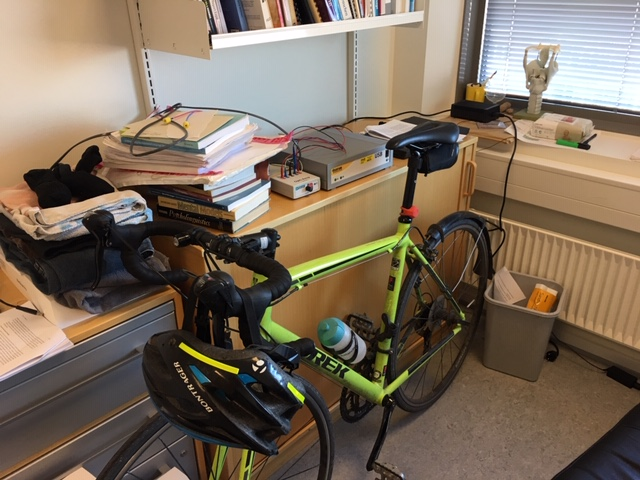

My ABR Project
========================================================
author: Ethan Weed
date: 
autosize: true

My dyslexia projects
========================================================

- Expanding dyslexia definition in Denmark
- Measuring reading comprehension in adults
- Music-training intervention in school-age children

High-frequency wordlist reading
========================================================

***

- you (du)
- arrow (pil)
- tree (træ)

Low-frequency wordlist reading
========================================================

***

- Irrelevance (irrelevans)
- Criteria (kriteria)
- Apoplectic (apoplektisk)

Pseudo-word reading
========================================================

***
- køm
- græ
- dri

Reading
========================================================

Reading
========================================================

Reading
========================================================

ABR and literacy in children (12 years old)
========================================================

Neef, N. E., Schaadt, G., & Friederici, A. D. (2017). Auditory brainstem responses to stop consonants predict literacy. Clin Neurophysiol, 128(3), 484-494

ABR and literacy and phonology
========================================================

## In children

- age 
- sex (e.g. Quinn and Wagner, 2015)
- familial risk (Pennington and Lefly, 2001)
- parental education (e.g. Friend et al., 2008)
- intelligence (e.g. Hatcher and Hulme, 1999)
- phonological awareness (e.g. Wagner and Torgesen, 1987)

***
## In adults

- Reading history (ARHQ-R)
- Reading:
	- Word-reading
	- Reading comprehension
- EEG:
  - ABR
  - ERP
- Working memory
	- N-back
	- Digit span

ABR and literacy in adults
========================================================
"Easy" question to start with: Does delta cross-phase predict with phonological awareness measures in adults?
Measures:

1. ABR
2. Dyslexia test results

My equipment
========================================================

My lab
========================================================

My /da/
========================================================

Problems to be solved
========================================================
- SmartEP system software
- Recording clean ABR's
- cross-phase analysis
